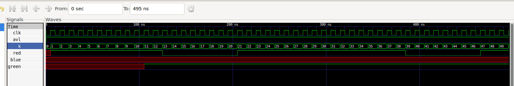
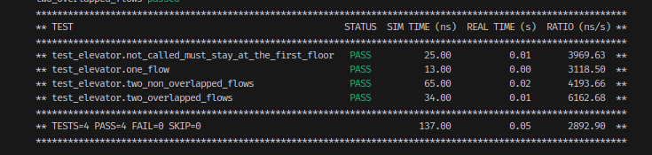
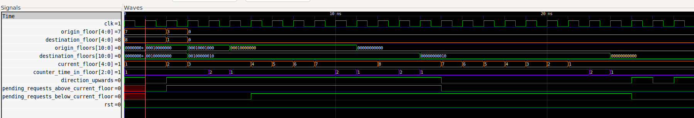

## Traffic Light

With Icarus Verilog + GTKWave

```bash
iverilog -o traffic_light_tb.vvp *.v
vvp traffic_light_tb.vvp
gtkwave *.vcd
```



## Elevator

With Icarus Verilog + cocotb + GTKWave

Dockerized, Local Ubuntu 22.04. In Repo root:

```bash
make setup
make sim
```






